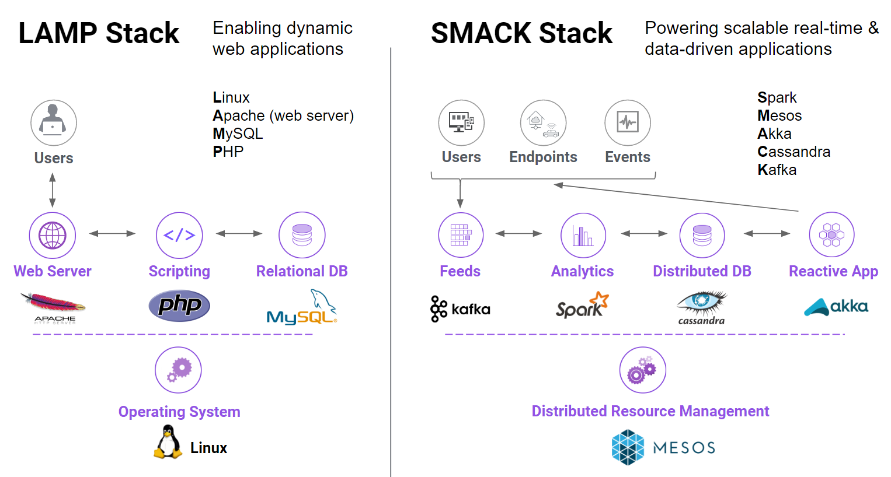
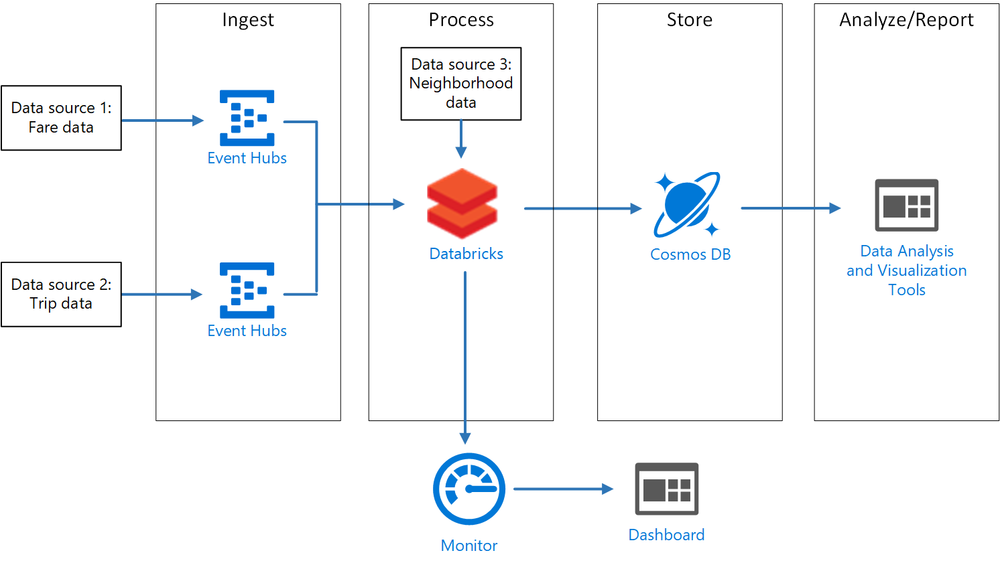
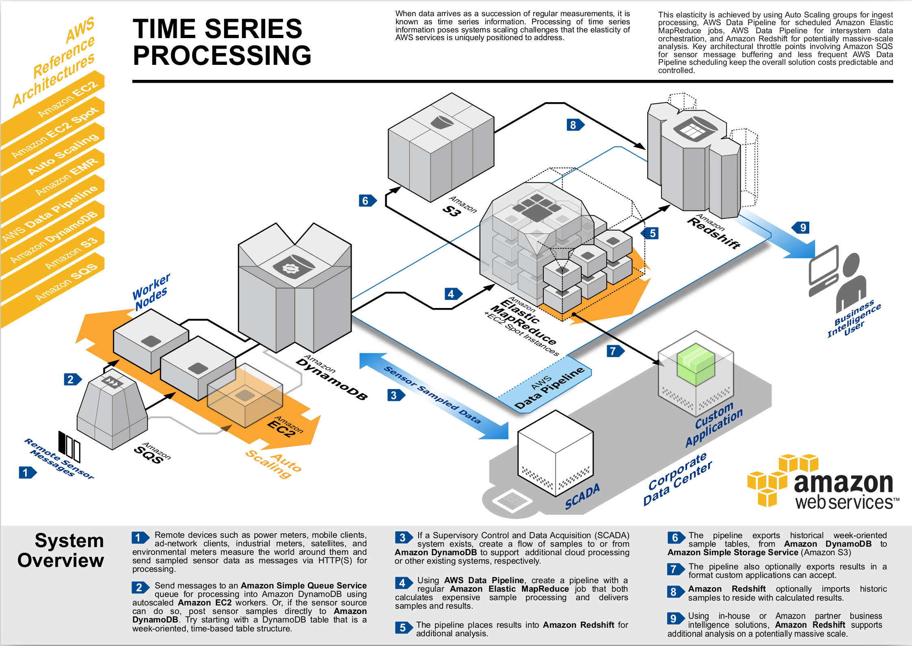
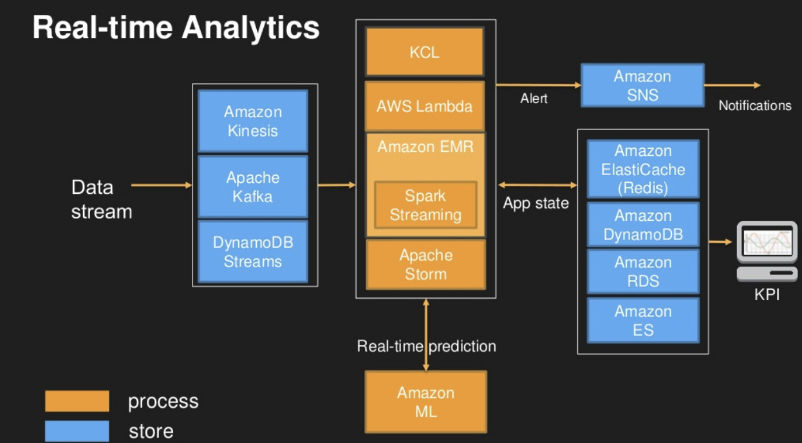

# Real Time Large Scale Data Processing on Azure , AWS and SMACK Stack

In the SaaS platform, we usually need to process large scale data on the real time,  have the artificial intelligent engine to analyze the data on the fly and visualize the analysis result dynamically. 

Real Time data processing is a key part of the SaaS artificial intelligent platform.  While the distributed stream system and AI platform architectures are evolving, it is good to evaluate the different solutions with pros and cons and try to find the "fit" for particular business needs. 

In this project,  I am going to evaluate the real time data stream processing using different platforms. That includes Kafka, Spark, Data-bricks, Managed Service on Azure vs. Moses on DC/OS

Content:

[Part I - SMACK Stack on Container Architecture](#part-i---smack-stack-on-container-architecture)

[Part II - Kafka Spark Databricks on Azure Managed Service](#part-ii---kafka-spark-databricks-on-azure-managed-service)

[Part III - Kafka Spark (Amazon Kinesis EMR) on Amazon Managed Service](h#part-iii---kafka-spark-amazon-kinesis-emr-on-amazon-managed-service)

## Part I - SMACK Stack on Container Architecture

[Source: Mesosphere https://mesosphere.com/blog/smack-stack-new-lamp-stack/]

“SMACK” stack:

- **Spark** – A general engine for large-scale data processing, enabling analytics from SQL queries to machine learning, graph analytics, and stream processing
- **Mesos** – Distributed systems kernel that provides resourcing and isolation across all the other SMACK stack components. Mesos is the foundation on which other SMACK stack components run.
- **Akka** – A toolkit and runtime to easily create concurrent and distributed apps that are responsive to messages.
- **Cassandra** – Distributed database management system that can handle large amounts of data across servers with high availability.
- **Kafka** – A high throughput, low-latency platform for handling real-time data feeds with no data loss.

## Part II - Kafka Spark Databricks on Azure Managed Service

Microsoft AI Reference Architecture [Source: https://docs.microsoft.com/en-us/azure/architecture/reference-architectures/ai/real-time-recommendation]

Microsoft Big Data Reference Architeture [Source: https://docs.microsoft.com/en-us/azure/architecture/reference-architectures/data/stream-processing-databricks#architecture]

## Part III - Kafka Spark (Amazon Kinesis EMR) on Amazon Managed Service

Amazon Reference Architecture of Time Series Data Processing. https://aws.amazon.com/architecture/

[Source: https://media.amazonwebservices.com/architecturecenter/AWS_ac_ra_timeseriesprocessing_16.pdf]

Amazon Reference Architecture of Real-time Analytics 

## Technology Stacks - Getting Started

To get start, let's take a look at what Kafka, Spark and Databricks do. 

https://kafka.apache.org/

https://spark.apache.org/

### Kafka

Kafka Concepts:

- Kafka is run as a cluster on one or more servers that can span multiple datacenters.
- The Kafka cluster stores streams of *records* in categories called *topics*.
- Each record consists of a key, a value, and a timestamp.

Kafka Retention Policy:

- Configurable retention period.
- All records will be purged after the retention period no matter that has been consumed or not.
- Data volume won't impact performance so keeping longer retention period should not impact the Kafka performance but just need more space for keeping the data. 

Kafka Fault Tolerance:

- "Leader" and "Follower" architecture for each partition.  "Leader" handle all the read and write. If a "Leader" down, a new leader will be elected from the "Followers". 
- All partitions are replicated to multiple nodes with configurable number of replication nodes. 
- Each of the node server as one or multiple partitions "Leader" node so the load could be balanced.

Kafka Geo-Replication:

- Kafka MirrorMaker support active/active and active/passive replication.  Active / passive is for backup and replication. Active / active - for putting to a location closer to some users.

Kafka Topics:

- Partition-able
- Multiple subscribers
- Consumer has off-set meta data in the log

Kafka Core APIs:

- The [Producer API](https://kafka.apache.org/documentation.html#producerapi) allows an application to publish a stream of records to one or more Kafka topics.
- The [Consumer API](https://kafka.apache.org/documentation.html#consumerapi) allows an application to subscribe to one or more topics and process the stream of records produced to them.
- The [Streams API](https://kafka.apache.org/documentation/streams) allows an application to act as a *stream processor*, consuming an input stream from one or more topics and producing an output stream to one or more output topics, effectively transforming the input streams to output streams.
- The [Connector API](https://kafka.apache.org/documentation.html#connect) allows building and running reusable producers or consumers that connect Kafka topics to existing applications or data systems. For example, a connector to a relational database might capture every change to a table.

[Source: https://kafka.apache.org/intro]

### Spark

Spark concepts:

- 

## References

[1] https://kafka.apache.org/intro

[2] https://lenadroid.github.io/posts/kafka-hdinsight-and-spark-databricks.html

[3] https://github.com/lenadroid/kafka-spark-azure

[4] https://www.youtube.com/watch?v=tDAoIzF-7q0

[5] https://www.slideshare.net/Hadoop_Summit/design-patterns-for-real-time-streaming-data-analytics

[6] https://docs.microsoft.com/en-us/azure/architecture/reference-architectures/ai/real-time-recommendation

[7] https://aws.amazon.com/architecture/

[8] Mesosphere Webinar: Building Data-Rich Apps with the "SMACK" Stack  https://www.youtube.com/watch?time_continue=537&v=jV1WsUuQNck

