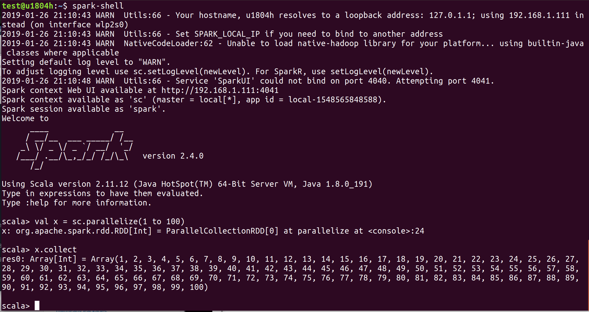
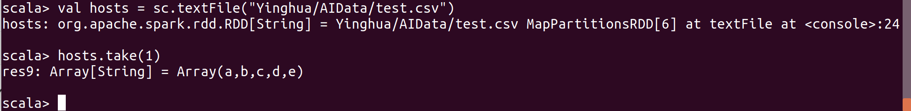

# Mining Massive Data Sets

**Stanford CS 246 - Mining Massive Data Sets**

Website of the lab http://www.mmds.org/

**Video archive for Winter 2019**

Get the latest update from <<http://snap.stanford.edu/class/cs246-videos-2019/>> 

| **Date**       | **Title**                                 | **Download**                                                 | **Size** |
| -------------- | ----------------------------------------- | ------------------------------------------------------------ | -------- |
| Jan 08,   2019 | Introduction;   MapReduce and Spark       | [Video](http://snap.stanford.edu/class/cs246-videos-2019/lec1_190108-cs246-720.mp4) | 1G       |
| Jan 10,   2019 | Frequent   itemsets and Association rules | [Video](http://snap.stanford.edu/class/cs246-videos-2019/lec2_190110-cs246-720.mp4) | 1.4G     |
| Jan 15,   2019 | Locality-Sensitive   Hashing              | [Video](http://snap.stanford.edu/class/cs246-videos-2019/lec3_190115-cs246-720.mp4) | 1.3G     |
| Jan 17,   2019 | Theory   of Locality-Sensitive Hashing    | [Video](http://snap.stanford.edu/class/cs246-videos-2019/lec4_190117-cs246-720.mp4) | 1.2G     |
| Jan 22,   2019 | Clustering                                | [Video](http://snap.stanford.edu/class/cs246-videos-2019/lec5_190122-cs246-720.mp4) | 1.4G     |
| Jan 24,   2019 | Dimensionality   Reduction: SVD and CUR   | [Video](http://snap.stanford.edu/class/cs246-videos-2019/lec6_190124-cs246-720.mp4) | 1.4G     |
| Jan 10,   2019 | Spark   Tutorial                          | [Video](http://snap.stanford.edu/class/cs246-videos-2019/190110-cs246-rs-720.mp4) | 1.1G     |
| Jan 15,   2019 | Proof   Techniques + Probability Review   | [Video](http://snap.stanford.edu/class/cs246-videos-2019/190115-cs246-rs-720.mp4) | 1.3G     |
| Jan 17,   2019 | Linear   Algebra Review                   | [Video](http://snap.stanford.edu/class/cs246-videos-2019/190117-cs246-rs-720.mp4) | 1.2G     |

All previous videos online - Mining Massive Datasets

<https://www.youtube.com/channel/UC_Oao2FYkLAUlUVkBfze4jg/videos>

## Textbooks  

CMPE 256 textbooks. 

[MMDS] Mining of Massive Datasets, by Jure Leskovec, Anand Rajaraman and Jeffrey Ullman, 2nd edition, Cambridge University Press, December 2014 (download from <http://infolab.stanford.edu/~ullman/mmds/book.pdf>)  

[RS] Recommender Systems: The textbook, by Charu Aggrawal Springer, 2016, ISBN 978-3-319-29659-3 (available in pdf from the SJSU Library at: <http://library.sjsu.edu>)  

[SAOM]Sentiment Analysis and Opinion Mining, by Bing Liu, Morgan & Claypool publishers, May 2012 (download the pre-publication version from <http://www.cs.uic.edu/~liub/FBS/SentimentAnalysis-andOpinionMining.pdf>)  

[SMM] Social Media Mining, An Introduction, by Reza Zafarni, Mohammad Ali Abasi, Huan Liu Cambridge University Press, 2014 (available to download at: <http://dmml.asu.edu/smm/SMM.pdf>)  

[NCM] Networks, Crowds, and Markets, by D. Easley and J. Kleinberg Cambridge University Press, 2010 (available to download at: <https://www.cs.cornell.edu/home/kleinber/networks-book/networks-book.pdf>) 

[IIR] Introduction to Information Retrieval, by Christopher D. Manning, Prabhakar Raghavan and Hinrich Schütze, available at: <https://nlp.stanford.edu/IR-book/information-retrieval-book.html> 

Reference textbooks (not required) 

Opinion Mining and Sentiment Analysis, by Bo Pang and Lillian Lee, in Foundations and Trends in Information Retrieval, Vol.2, No. 1-2 (2008 (download the pre-publication version from <http://www.cs.cornell.edu/home/llee/omsa/omsa.pdf>) 

Web Data Mining: Exploring Hyperlinks, Contents, and Usage Data, by Bing Liu Springer (2007 or 2011 edition), ISBN: 3540378812  

Recommender Systems Handbook, Francesco Ricci, Lior Rokach, Bracha Shapira, and Paul B. Kantor, editors, Springer US, 2011, ISBN: 978-0-387-85819-7 

Data Mining: Concepts and Techniques, by Jiawei Han, Micheline Kamber and Jian Pei Morgan Kaufmann, Elsevier Inc. (2011), ISBN: 9780123814791 (available as ebook from the SJSU Library)Library Liaison (Optional) 

Please note that this one need to open use the Adobe Digital version.  I have installed on the laptop and authorized with this device on

<https://ebookcentral-proquest-com.libaccess.sjlibrary.org/lib/sjsu/reader.action?docID=729031&ppg=1>


## Environment Setup

To process the large scale data,  I plan to use Jupyter Notebook, Python, Spark and Scala. 

### Jupyter Notebook

Python and Jupyter Notebook is required. I am installing Jupyter using Anaconda.

It could be downloaded here: https://www.anaconda.com/download/

In order to launch the Jupyter Notebook with my project folder as root folder, I have created a link file with following property as the command. 

C:\ProgramData\Anaconda3\python.exe C:\ProgramData\Anaconda3\cwp.py C:\ProgramData\Anaconda3 C:\ProgramData\Anaconda3\python.exe C:\ProgramData\Anaconda3\Scripts\jupyter-notebook-script.py "my_project_folder"

### Spark

Spark Crush Course - http://snap.stanford.edu/class/cs246-videos-2019/190110-cs246-rs-720.mp4

#### Prerequisite - Install Java. 

https://www.java.com

#### Step #1 - Download and extra Spark files

https://spark.apache.org/downloads.html

```
sudo tar -xvf spark-2.4.0-bin-hadoop2.7.tgz -C /home/test/
```

Create a link for the spark folder.

```
 ln -s spark-2.4.0-bin-hadoop2.7/ spark
```

#### Step #2 - Add the environment variables SPARK_HOME and PATH.

```
cd /home/test
vi .bashrc
```

Add following into the .bashrc

```
export SPARK_HOME=/home/test/spark
export PATH=$PATH:$SPARK_HOME/bin
```

Run the bashrc. 

```
. .bashrc
```

Verify the path. 

```
echo $PATH
```

#### Step #3 - Verify that the Spark is running. 

Run the spark-shell	

```
spark-shell
```



Run the Spark command to read text file.

```
val hosts = sc.textFile("Yinghua/AIData/test.csv")
hosts.take(2)
```




